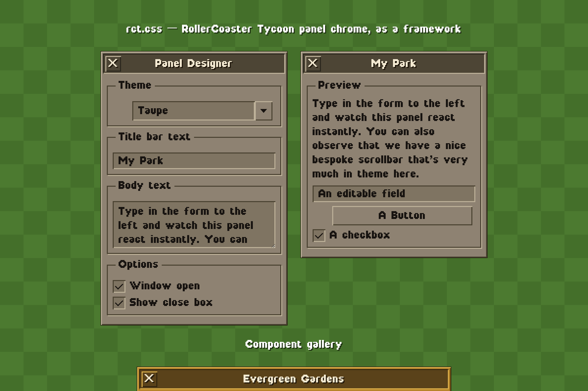

# rct.css

rct.css is a small CSS framework. It recreates the **RollerCoaster Tycoon 2**
window chrome: flat fills, 2px light/dark bevel edges, the RCT2 pixel font with
anti-aliasing turned off, and CSS-only windows and dropdowns built from `<details>`.

The source is Sass. rct.css ships as one plain file, **`dist/rct.css`**. You can
add it to any page. You can also reskin it fully in plain CSS, with no build step.



> See the live demo: open [`docs/index.html`](docs/index.html) in a browser.

## Install

Add the compiled file to your page:

```html
<link rel="stylesheet" href="dist/rct.css">
<!-- optional: adds dropdown select-and-close behavior -->
<script src="js/rct.js" defer></script>
```

The stylesheet loads its bundled font from `../fonts/rct2.otf`, relative to the CSS
file. Keep `dist/` and `fonts/` as sibling folders. This is the default layout, and
a CDN serves the package the same way.

## A minimal window

```html
<details class="rct-window rct-window--taupe" open>
  <summary class="rct-titlebar">
    <span class="rct-close" aria-hidden="true">X</span>Options
  </summary>
  <div class="rct-body">
    <fieldset class="rct-group">
      <legend>Controls</legend>
      <button class="rct-button rct-button--wide" type="button">Customize Keys…</button>
      <label class="rct-checkbox"><input type="checkbox" checked> Scroll at edge</label>
    </fieldset>
  </div>
</details>
```

Windows are `<details>` elements. **When you click the title bar, the window rolls
up** and leaves only the bar. This needs no JavaScript.

## Components

| Class | Element | Notes |
| --- | --- | --- |
| `.rct-window` | `<details>` | The frame; also sets the RCT type context. Add a theme modifier. |
| `.rct-titlebar` | `<summary>` | Roll-up title bar. Put a `.rct-close` inside it. |
| `.rct-body` | `<div>` | Padded content area. |
| `.rct-tabs` / `.rct-tab` | `<div>` / `<button>` | Tab strip; add `.is-active` to the current tab. Give tabs `data-tab="id"` + panels `data-tab-panel="id"` for rct.js switching. |
| `.rct-page` / `.rct-heading` | `<div>` / `<h2>` | Tab page body and yellow heading. |
| `.rct-group` | `<fieldset>` + `<legend>` | Etched group box. |
| `.rct-dropdown` | `<details>` | CSS-only select: `.value` well + `.arrow`, then a `.rct-menu` of `.item`s. |
| `.rct-button` | `<button>` | Add `.is-pressed` to pin it down, `.rct-button--wide` to fill a group. |
| `.rct-checkbox` | `<label>` + `<input type="checkbox">` | Native input, redrawn. |
| `.rct-input` | `<input type="text">` / `<textarea>` | Recessed text-field well; `.rct-input--wide` to indent inside a group. |
| `dialog.rct-window` | `<dialog>` | Modal styled as a window. Open with `.showModal()` or a `[data-rct-open="id"]` button; close with `[data-rct-close]`, Escape, or a backdrop click. |
| `.rct-scene` / `.rct-stage` / `.rct-row` | layout helpers | Optional grass backdrop, window shelf, inline control row. |

The framework never styles your `<body>`. The typographic baseline lives on
`.rct-window`, and on the opt-in `.rct-scene`. So `rct.css` changes nothing on an
existing page until you use an `.rct-*` class.

## Theming

Every component reads six CSS custom properties. The built-in themes set these
properties:

| Variable | Controls |
| --- | --- |
| `--body` | frame / button / tab surface |
| `--light` | raised bevel highlight (top-left) |
| `--dark` | raised bevel shadow (bottom-right) |
| `--field` | sunken input / value wells |
| `--title` | title bar + menu-hover fill |
| `--page` | tab page fill |

rct.css ships with four themes: `rct-window--taupe`, `rct-window--tan`,
`rct-window--slate`, and `rct-window--olive`.

### Add a theme — two ways

**No build** — override the six variables on any `.rct-window` in plain CSS:

```css
.rct-window--candy {
  --body:  #b0568a;
  --light: #dd8cbb;
  --dark:  #5e2748;
  --field: #9c4879;
  --title: #4a1f38;
  --page:  #b0568a;
}
```

**With Sass** — add an entry to the `$themes` map in `src/_tokens.scss`. Then
rebuild. Sass generates the `.rct-window--<name>` class for you.

## The rct.js enhancer

`js/rct.js` is optional progressive enhancement. Every component still works
without it. It auto-initializes on load. If you inject markup after load, call
`RCT.init(rootElement)`. `RCT.init` is idempotent. It wires three things:

- **Dropdowns** — these behave like a real `<select>`. When you open one dropdown,
  the others close. When you click an item, rct.js writes its label into the value
  well and closes the menu. A click outside closes everything.
- **Tabs** — when you click `.rct-tab[data-tab="id"]`, rct.js marks it active. It
  then shows the matching `[data-tab-panel="id"]` in the same window and hides the
  rest.
- **Modals** — a `[data-rct-open="id"]` button opens that `<dialog>`. A
  `[data-rct-close]` button, the Escape key, or a backdrop click closes it.

## Build from source

rct.css needs [Dart Sass](https://sass-lang.com/). Dart Sass is a dev dependency
only. rct.css has no runtime dependencies.

```bash
npm install
npm run build      # -> dist/rct.css and dist/rct.min.css
npm run watch      # rebuild on change
```

Or with the Makefile: `make build`, `make watch`, `make serve` (live demo), `make clean`.

The source lives in `src/`. `_tokens.scss` holds the pixel grid and the theme
palettes. `_mixins.scss` holds the `raised()` and `sunken()` bevel grammar. Each
component has one partial under `src/components/`.

## The pixel grid (why the magic numbers)

The RCT2 font's grid is 1/16 em, so sharp sizes are multiples of 16px. At the 32px
base, one font-pixel equals 2px on screen. This matches a `@2x` game screenshot, and
it is why every bevel is 2px. Glyph ink fills only the top half of the em, so the
line-height is below 1. To rescale the whole system, change `$unit` or `$font-size`
in `src/_tokens.scss`. Stay on multiples of 16px to keep glyphs sharp.

## Licenses

The **rct.css stylesheets and JavaScript are MIT licensed** (see [`LICENSE`](LICENSE)).

The bundled font is licensed separately and **requires attribution**:

> The FontStruction “RCT2” (https://fontstruct.com/fontstructions/show/465125)
> by “Qimplef” is licensed under a Creative Commons Attribution Share Alike
> license (http://creativecommons.org/licenses/by-sa/3.0/).

The font is CC BY-SA 3.0. If you redistribute it, you must keep this attribution and
stay under a compatible ShareAlike license.

The docs page (`docs/index.html`) also uses **Departure Mono** for code. Helena
Zhang made it. It uses the [SIL Open Font License 1.1](fonts/DEPARTURE-MONO-LICENSE.txt).
The framework itself does not need it.
